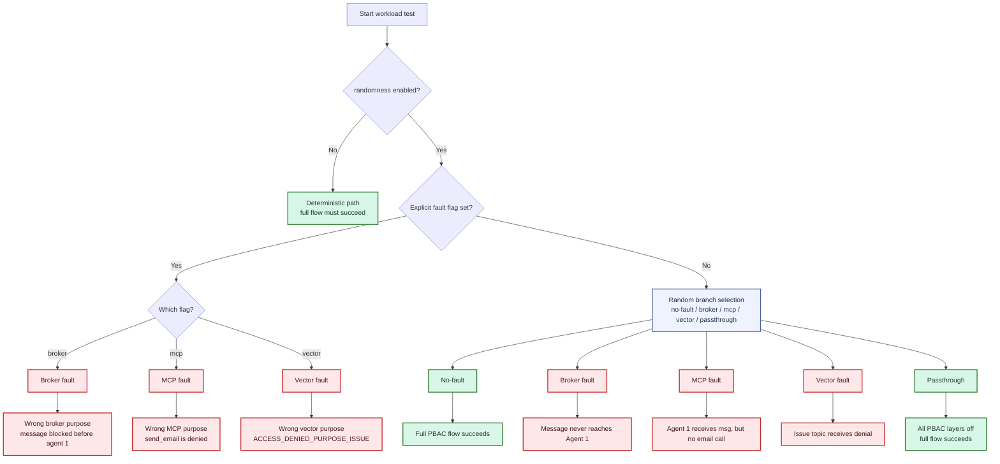

## Test Notes
Use this test to verify every workload branch once on its own and then repeat the same branch a few times to catch cleanup or isolation issues.

If you start the test with more then one message (`--amount-messages > 1`), the test will run with the same PBAC configuration that was selected for the first message. If you want to run the test with differend branches or a differend PBAC configuration, just start the test multiple times with `--amount-messages=1`.

## Branch Selection
`test_workload_purpose_isolation_scenario` now behaves like this:

- `--randomness=False` -> always run the no-fault path.
- `--randomness=True` and no BPAC branch flag set -> pick one branch at random, including the no-fault PBAC-variation branch.
- `--randomness=True` and one branch flag set -> use that branch and ignore the others.

Set at most one of these flags when you want a specific branch:

- `--broker-enabled` -> broker fault branch
- `--mcp-enabled` -> MCP fault branch
- `--vector-enabled` -> vector fault branch

If none of those are set and `--randomness=True`, the test randomly chooses between:

- no-fault PBAC-variation branch
- broker fault branch
- MCP fault branch
- vector fault branch
- passthrough branch

## Workload flow diagram



### Branch summary

- No-fault: everything is allowed; full flow should succeed.
- Broker fault: agent subscribes with a wrong purpose so the message is blocked before reaching it.
- MCP fault: agent is allowed to receive the message but uses a forbidden purpose for the tool call, so `send_email` must not be invoked.
- Vector fault: vector search is denied due to a mismatched state/purpose and raises an issue on the issue topic.
- Passthrough: all PBAC layers are disabled; the full workload runs as a plain success path.

## TODOs
The no-fault path now randomizes PBAC activation/deactivation once per run when `--randomness=True` and no explicit fault branch is selected.

## Commands

No-fault path, repeated 1 time:

```sh
uv run pytest tests/subsidy_benchmarking/purpose_isolation/test_workload.py -vv -s \
  --broker-enabled --mcp-enabled --vector-enabled \
  --amount-messages=1 --randomness=False
```

Broker fault branch, repeated 1 time:

```sh
uv run pytest tests/subsidy_benchmarking/purpose_isolation/test_workload.py -vv -s \
  --broker-enabled \
  --amount-messages=1 --randomness=True
```

MCP fault branch, repeated 1 time:

```sh
uv run pytest tests/subsidy_benchmarking/purpose_isolation/test_workload.py -vv -s \
  --mcp-enabled \
  --amount-messages=1 --randomness=True
```

Vector fault branch, repeated 1 time:

```sh
uv run pytest tests/subsidy_benchmarking/purpose_isolation/test_workload.py -vv -s \
  --vector-enabled \
  --amount-messages=1 --randomness=True
```

Random branch selection, repeated 1 time:

```sh
uv run pytest tests/subsidy_benchmarking/purpose_isolation/test_workload.py -vv -s \
  --amount-messages=1 --randomness=True
```

